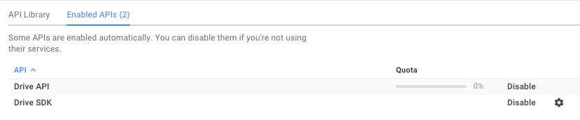
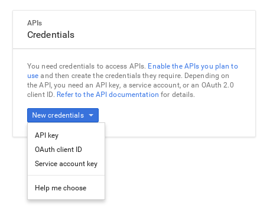

# Chrome History to Google Sheets

This repository contains all the code you need to start programmatically exporting your browsing history to a Google Sheet.

The reason I created this was to easily serve an API of this data for my [site](https://ferrucc.io) where I'm running a social experiment, publicly sharing my browsing for a month.

To create an API from Google Sheets I'm using [Sheety](https://sheety.co/).

This script runs every hour.

# Setup

1) Clone this repository

2) Create a .env file like the .env.example and fill in the following data:

    1) Write the Document ID of the Google Sheet you want to use in SHEET.

    2) Head to [Google Developers Console](https://console.developers.google.com/project) and create a new project (or select the one you have.)

    3) Under “API & auth”, in the API enable “Drive API”.

    

    4) Go to “Credentials” and choose “New Credentials > Service Account Key”.

    

    It will download a .json file.

    Put that .json file inside of the folder with this code.

    Replace CREDENTIALS in the .env file with the name of the file you downloaded:

```
CREDENTIALS=Drive-weird00number.json
```

    5) Open the .json and copy the `client_email` field: `"client_email": "123456789-yoursisdifferent@developer.gserviceaccount.com"`

    6) Go to your Google Sheet and share it with editing permissions to that email.

3) Run `export-chrome-history.py`

And there you go! Visit the google doc you linked and it will contain all your browsing history.
